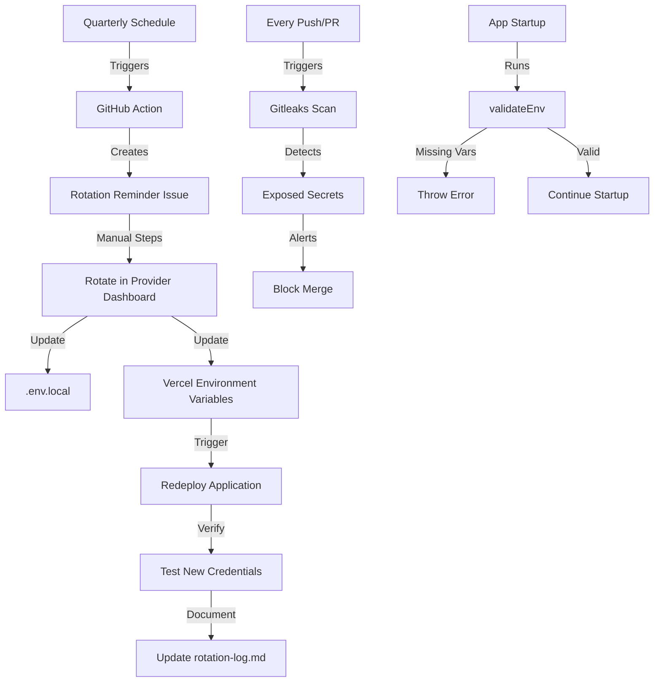

# Security Implementation Summary

## Overview

This directory contains security policies, automation, and tracking for credential management in the Oikion MVP application.

## What Was Implemented

### 1. Runtime Environment Validation

**Files**: `lib/env.ts`, `app/[locale]/layout.tsx`, `tests/env-validation.test.ts`

- Validates required environment variables at application startup (production only)
- Uses Zod schema to ensure DATABASE_URL, CLERK_SECRET_KEY, and other critical credentials are present
- Prevents deployment with missing or invalid credentials
- Test coverage: 4 passing tests

### 2. Secret Scanning Automation

**File**: `.github/workflows/secret-scan.yml`

- Automated Gitleaks scanning on every push, PR, and daily at 4 AM UTC
- Detects accidentally committed secrets before they reach production
- Integrates with GitHub Security tab for alerts
- Free within GitHub Actions limits

### 3. Credential Rotation Policy

**File**: `docs/security/credential-rotation-policy.md`

- Defines rotation schedule for all credentials (90-180 day intervals)
- Documents rotation procedures and verification steps
- Includes emergency rotation protocol
- Specifies ownership and responsibilities

### 4. Automated Rotation Reminders

**File**: `.github/workflows/credential-rotation-reminder.yml`

- Automatically creates GitHub Issues every quarter (Jan 1, Apr 1, Jul 1, Oct 1)
- Issues include complete checklist of credentials to rotate
- Links to provider dashboards and rotation procedures
- Tracks "last rotated" dates for compliance

### 5. Rotation Tracking

**File**: `docs/security/rotation-log.md`

- Historical log of all credential rotations
- Tracks date, credential type, person, reason, and notes
- Updated after each rotation for audit trail
- Shows next scheduled rotations

## How It Works



## Remaining Manual Steps

The following tasks require manual action (cannot be fully automated):

1. **Rotate credentials** in provider dashboards:
   - Prisma Data Platform (DATABASE_URL)
   - Clerk Dashboard (CLERK_SECRET_KEY)
   - Resend, Ably, OpenAI, Anthropic dashboards

2. **Update .env.local** with new credential values

3. **Update Vercel environment variables**:
   ```bash
   vercel env rm <VARIABLE> production preview
   vercel env add <VARIABLE> production preview
   ```

4. **Verify** old credentials are revoked and new ones work

## Testing

Run environment validation tests:

```bash
pnpm test tests/env-validation.test.ts
```

All tests should pass (4/4).

## Next Steps

### Immediate (if not done yet)
- [ ] Rotate all exposed credentials from `.env.local`
- [ ] Update Vercel environment variables
- [ ] Verify application works with new credentials
- [ ] Add first entry to `rotation-log.md`

### Future Enhancements
- [ ] Integrate AWS Secrets Manager or HashiCorp Vault for automatic rotation
- [ ] Add Clerk API automation for `rotateSecretKey()`
- [ ] Create Vercel API script to update env vars programmatically
- [ ] Set up monitoring alerts for credential age

## Files Reference

| File | Purpose |
| --- | --- |
| `credential-rotation-policy.md` | Rotation schedule and procedures |
| `rotation-log.md` | Historical tracking of rotations |
| `index.md` | Directory structure and usage notes |
| `README.md` | This file - implementation summary |

## Related Files

- `lib/env.ts` - Runtime environment validation
- `tests/env-validation.test.ts` - Validation tests
- `.github/workflows/secret-scan.yml` - Gitleaks scanning
- `.github/workflows/credential-rotation-reminder.yml` - Quarterly reminders
- `app/[locale]/layout.tsx` - Calls `ensureEnvValidated()` on startup

## Support

For questions about security policies or credential rotation:
- Review the [Credential Rotation Policy](./credential-rotation-policy.md)
- Check the [Rotation Log](./rotation-log.md) for history
- Open a GitHub Issue with the `security` label
